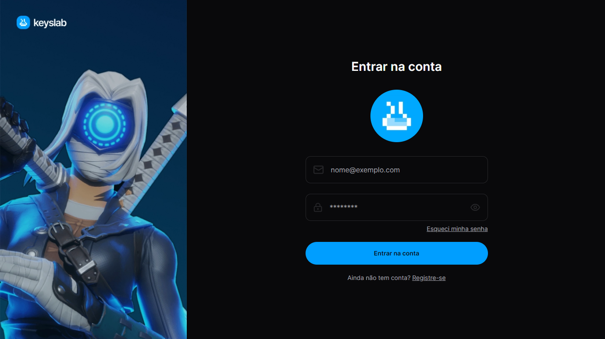

<h1 align="center"> Keyslab - Test </h1>

# Resumo do projeto

Aplicação de um desafio realizado pela keyslab, projeto de autenticação e cadastro de usuário!

## 🔨 Funcionalidades do projeto

- `Funcionalidade 1` `Realizar login`: O usuário poderá realizar o login na plataforma com e-mail e senha.

- `Funcionalidade 2` `Cadastrar usuário`: O usuário poderá se registrar na plataforma.

- `Funcionalidade 3` `Recuperar senha`: O usuário poderá recuperar sua senha através do seu e-mail cadastrado

- `Funcionalidade 3` `Editar usuário`: O usuário editar suas informações.

## RFs (Requisitos funcionais)

- [x] Deve ser possível se cadastrar;
- [x] Deve ser possível se autenticar;
- [x] Deve ser possível alterar as informações do usuário;
- [x] Deve ser possível recuperar a senha do usuário;

## RNs (Regras de negócio)

- [x] O usuário não deve poder se cadastrar com um e-mail nem username duplicado;
- [x] O e-mail de recuperação de senha so é enviado ao usuário se ele for cadastrado no sistema;
- [x] O usuário so poderá acessar a plataforma depois de logado;
- [x] Se tentar navegar na plataforma sem estar logado, o usuário e redirecionado para tela de login;

## RNFs (Requisitos não-funcionais)

- [x] As senhas tem que ter pelo menos 8 dígitos;
- [x] Os dados da aplicação precisam estar persistidos em um banco PostgreSQL;

## ✔️ Técnicas e tecnologias utilizadas

- `NextJS ⚛️`
- `TailwindCSS 🎨`
- `Zod 🔐`
- `React-hook-form 📃`
- `Axios 🌐`
- `React-Toastify ⚠️`
- `DOcker 🚀`
- `Prisma 💾`
- `Next-auth 🔒`
- `Next-SEO 📈`
- `Zustand 🎉`
- `NodeMailer 📃`


## 📁 Acesso ao projeto

### Run

**Install dependencies**

```
npm install ou pnpm install
```

**Run Dev**

```
npm run dev ou pnpm run dev
```

**Run Docker**

```
docker-compose up -d
```

Você pode acessar a aplicação clicando [aqui](https://keyslab-test.vercel.app).
